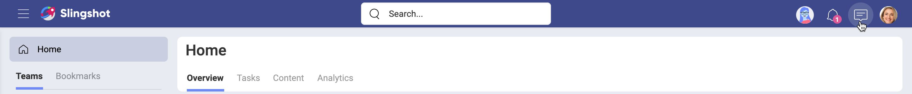
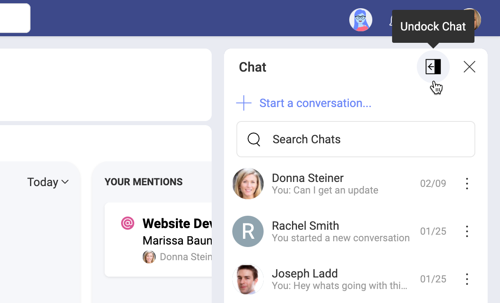
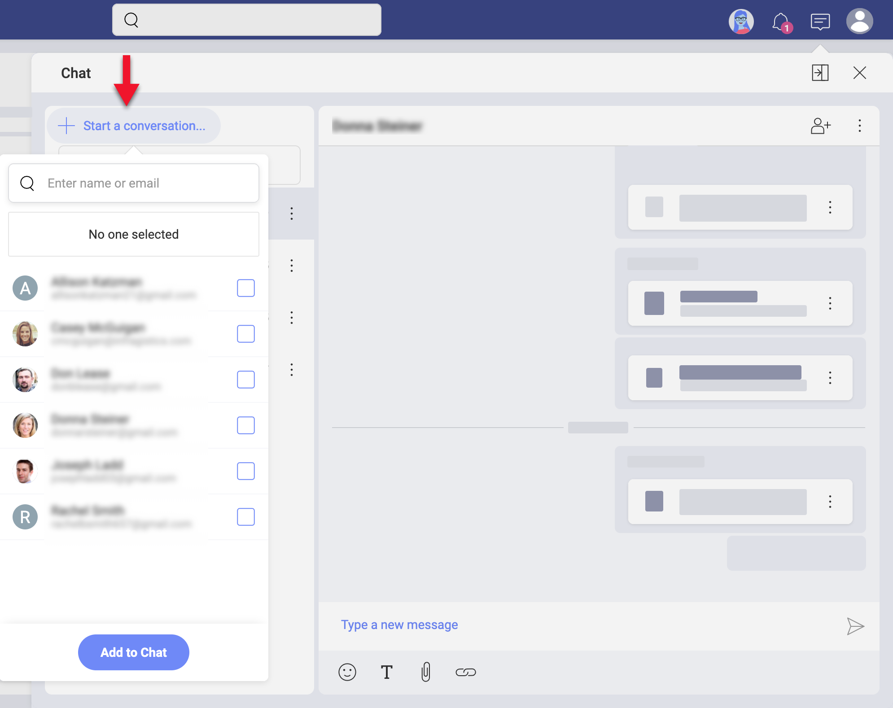
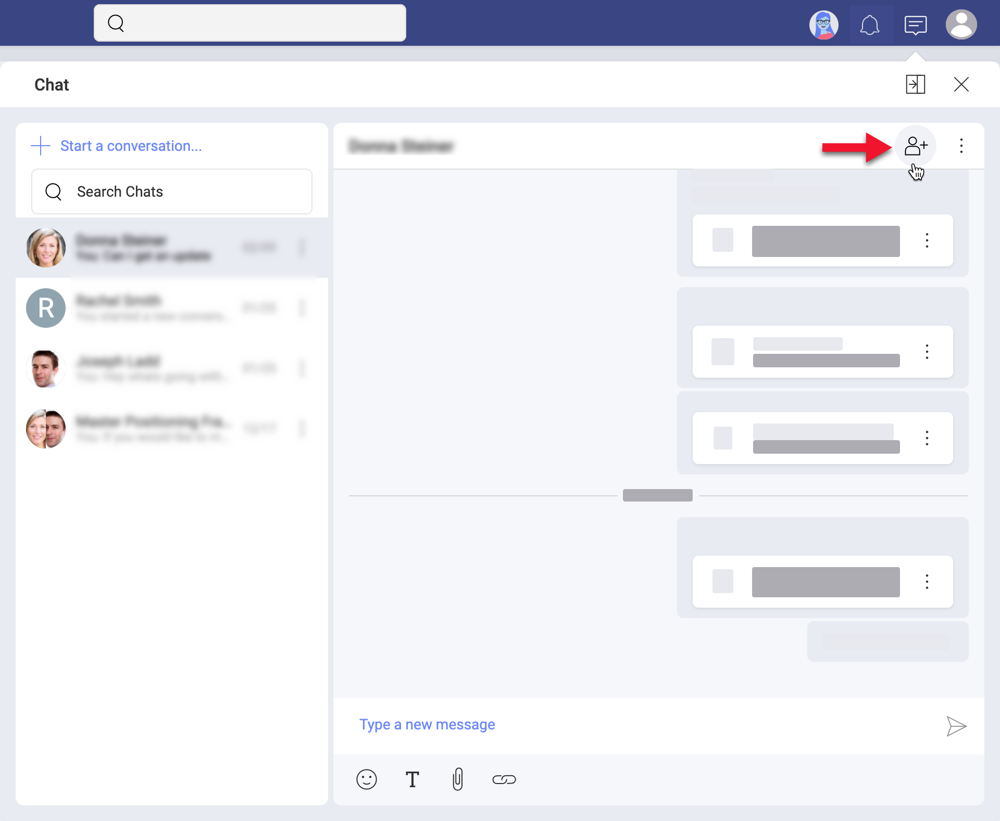
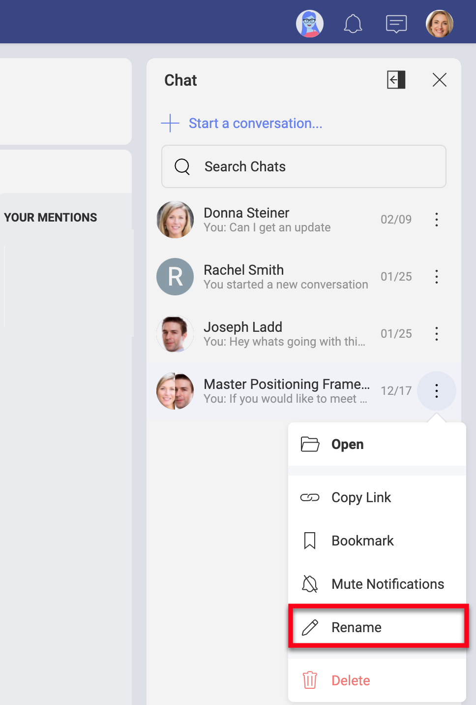
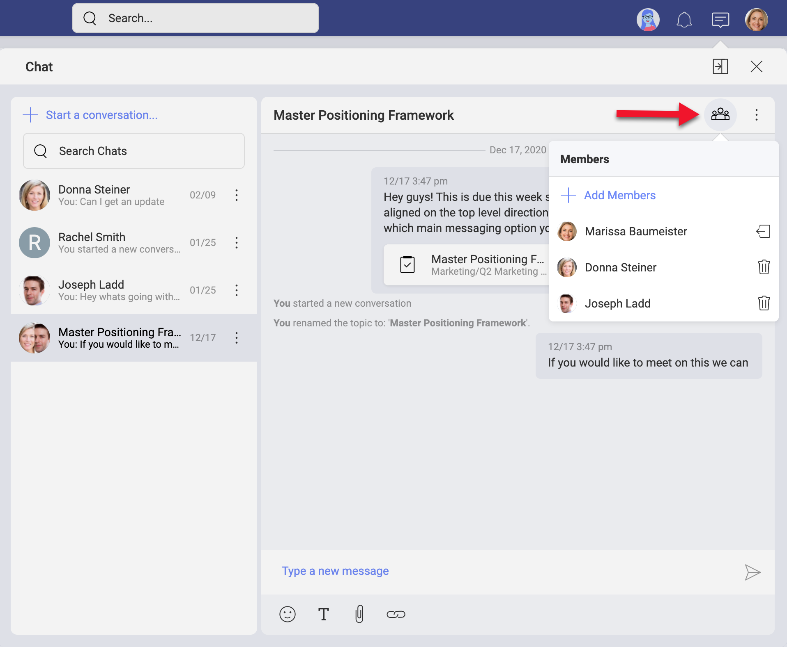
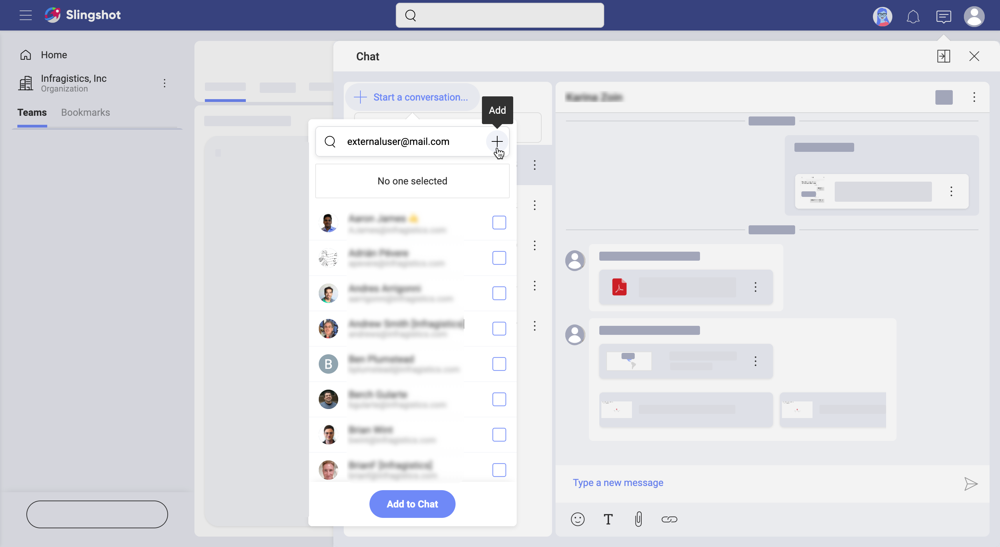

## Starting with Private Chat

Welcome!  
Read on to get answers to most of your questions about discussions.

### Discussions vs Private Chat

In Slingshot, communication happens in discussions and private chats. To participate and start discussions and private chats you need to know more about [writing, reading and managing messages](communication.html#write-read-manage-messages). 

Each team and project has its own space dedicated to discussions. Discussions are organized in topics. Discussions are team and project specific. Because of this, you will not be able to see and participate in all discussions in Slingshot. Read more about [who can access discussions](discussions-starting.html#discussions-access) by following the link.

Unlike the discussions, the private chat is project and team independent. This means you can chat with any user from any team or project. You can even [chat with external users](#chat-external-users). However, because they are *private*, your chats can be accessed only by you and the users you are chatting with. 

### How Can I Access My Chat?

In the top bar, right next to your profile picture, you will see the **chat message icon**. Click the icon to open the chat screen. 

### What is Docked/Undocked Chat Mode? 

The *docked/undocked* mode basically makes your chat screen appear differently.  

- **Docked** (minimized) mode  - you see a smaller screen where only your last chat room or the chat list is visible; 
- **Undocked** (maximized) mode - you see a larger scren where both your chat room and the chat list are visible. 

You can switch between modes by clicking/tapping the *dock/undock* icon next to *Close* (see screenshot below).

### How Can I Start a Private Chat?

To start a chat, open the chat screen. Then follow the steps below:

1. Click the **+ Start a conversation...** blue button. 

    

2. You will see a list of users from your main *Organization*. Select a user from that list or type a name or email in the *search* box on top.
3. Click/tap **Add to Chat**. 

A new chat room is automatically opened on the right. Your new chat is also added on top of your list of chats on the left. 

If you don't see the *Start a conversation...* button, then check your [chat mode](#chat-mode). If you are in *docked mode*, select the **undock** icon next to the *Close* button. 

### How Can I Start a Group Chat?

Sometimes you want to engage more people in a conversation, but creating a discussion is not an option for a number of reasons. For example, people you want to talk with are from different teams and projects and you even want to include a few external users. Or you don't want to create a permanent discussions topic. In these and other cases, you may prefer a group chat. 

A group chat is a chat between you and two or more users. 

Creating a group chat is similar to creating a private chat. Open the chat screen. Then you need to:
 
1. Click/tap **+ Start a conversation...** blue button. 
2. Add two or more users from the list. Alternatively, write users' names or emails in the *search* box. 
3. Click **Add to Chat**. 

If you don't see the *Start a conversation* blue button, check your [chat mode](#chat-mode). If you are in *docked mode*, select the **undock** icon next to the *Close* button. 

You can also create a group chat by **adding more users to a private chat**. This will creat a new group chat between the chosen users, but don't worry! Your original private chat will be kept too. To add more users to a private chat, open a private chat and select the *+ member* icon on top right (as shown below). 

Unlike private chats, you can create more than one chat between the same users. You can use the **rename** option of group chats to differentiate between them. Or you can simply name your group chat to make the subject of the chat clear to everyone. You will find the *rename* option in the *overflow* menu of a group chat (see below).

### How to Manage Members in a Group Chat? 

You can manage the members of a group chat by selecting the *group* icon on top of your chat room. 

A dropdown showing a list of chat members is collapsed.
You can use the *trash* icon next to each member's name in that list to remove a member from the chat. Every participant in a group chat can remove other members from the chat. Removed members can still view the history of the chat. 

Next to your name you will find the *leave* icon. You can leave a chat anytime. 

There is no limit to the number of chat participants. You can always add new users to a group chat by  clicking **+ Add Members**. Choose new members from the list of Slingshot users opened. At its bottom you will notice a **History** setting. The following 3 options appear in the dropdown when collapsed: 

- *Invite with No Previous History*
- *Invite with All Previous History*
- *Invite with Today's History*

*Invite with No Previous History* is the default history setting for new chat participants. However, sometimes you don't want people who join the group chat in the middle of a conversation, to miss all the earlier information. You can use the other two history options to welcome new chat members and quickly introduce them to the topic!

When finished, select the **Add to Chat** blue button. 

### How to Start a Chat with External Users?

All Slingshot users can participate in private and group chats, including the external users. 
However, external users are not part of your Organization. That's why after selecting **+ Start a conversation...** you will not see their names in the list of users. You can chat with them only if you add their emails manually in the search box as shown below.

### Deleting vs Leaving vs Muting a Chat

Once you lose interest, you can delete, leave or mute a chat in Slingshot.  

**Deleting** a chat makes it disappear from the chat list of all its participants. All chat history is deleted for everybody too. So make sure no one needs the chat or its history before you decide to delete it. To delete a chat, click on its **overflow menu** > **Delete**. 

**Leaving** a chat is an option for group chats only. Each member can leave a group chat when they decide they no longer need to participate in the conversation. The members, who left, cannot receive new messages anymore, but they still have access to the chat history. To leave a group chat, click on it to **open** > **Members icon on top** > **the leave icon** next to your name.

Normally, the chat icon on top shows the total number of unread chat messages. When you **mute** a private or group chat, its new messages are no longer added to that count. This is the option for you if you do not want to follow the conversation anymore, but you still want to have access to it. 
To mute a chat, click on its **overflow menu** > **Mute Notifications**. 